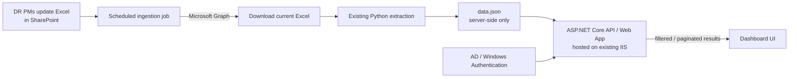
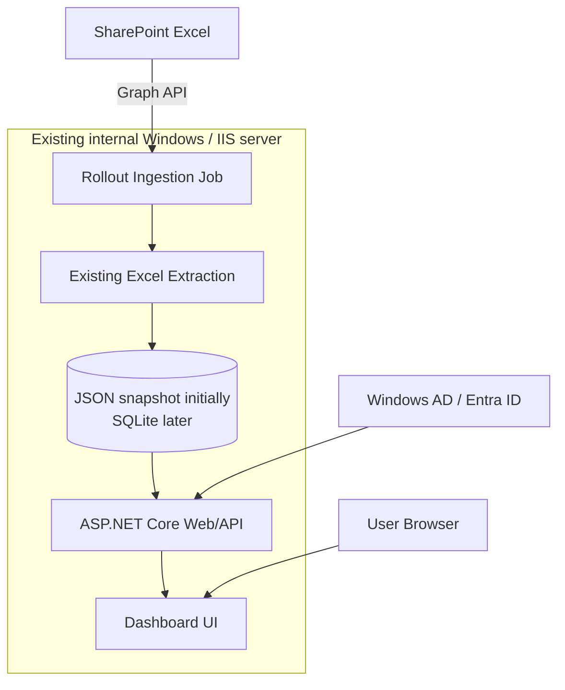
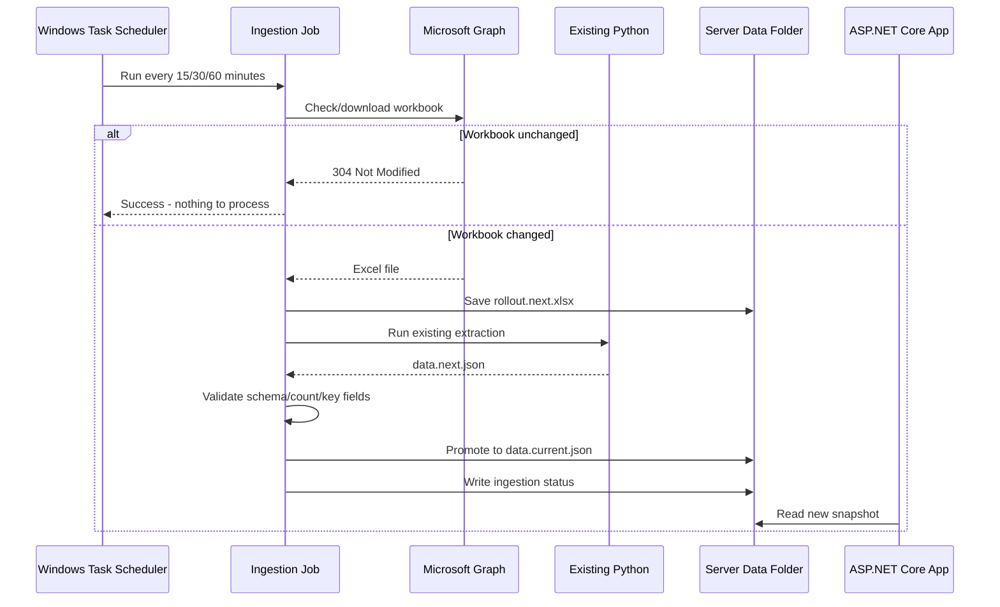
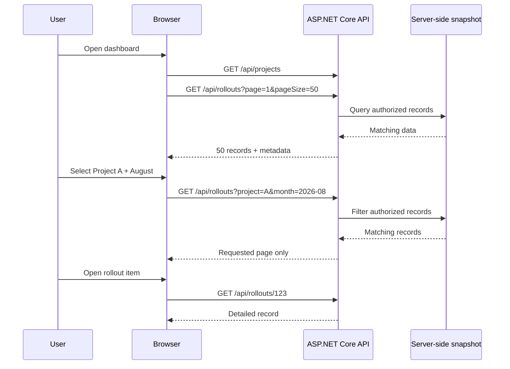
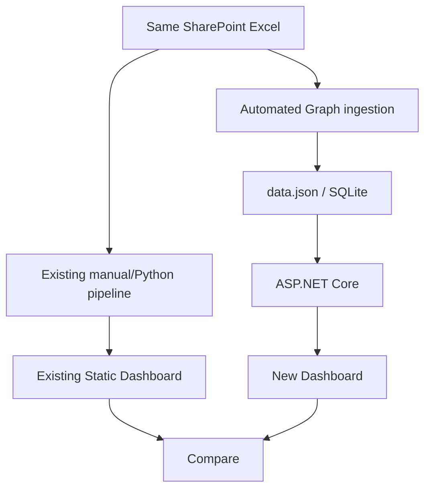
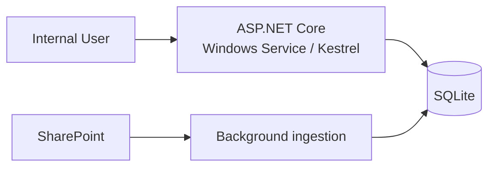
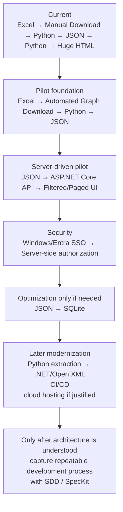

# Lowest-Cost Practical Migration from Static HTML to a Server-Driven Rollout Dashboard

## Executive summary

The lowest-cost and lowest-risk first move is **not** to redesign the whole dashboard, replace Python, introduce Azure, or start with SpecKit. The practical first pilot is to preserve as much of the existing pipeline as possible while changing the one architectural decision that is causing the scalability problem: **stop embedding the complete dataset into a generated HTML file and instead put a small server-side application between the data and the browser**.

Because you already have an internal IIS server, the recommended first architecture is:



ASP.NET Core is directly supported behind IIS through the ASP.NET Core Module, and IIS can provide Windows Authentication to the application, including populating `HttpContext.User` for authorization. That means an existing internal Windows/IIS environment can provide hosting and SSO without introducing a new paid hosting platform. citeturn0search0turn0search8turn12search7

For the **first pilot**, I recommend keeping the existing Excel-to-JSON Python transformation. Automate the SharePoint download, stop running the second Python script that creates the giant HTML file, place `data.json` on the server, and expose filtered/paginated information through ASP.NET Core. This lets you prove the server-driven architecture before spending time rewriting stable extraction logic.

The recommended order is therefore:

> **Automate ingestion → preserve Python transformation → serve JSON only from the server → add ASP.NET Core API → reuse/port the dashboard UI → add authentication and authorization → pilot alongside the existing static dashboard.**

A database is **not mandatory for the first pilot**. A read-only JSON snapshot can be perfectly reasonable while the data volume is modest because the important change is that the browser no longer receives all records. If query complexity or data size becomes a problem, SQLite is the natural zero-license-cost next step. SQLite is self-contained, public-domain software, and its own documentation describes it as appropriate for many low-to-medium-traffic websites; EF Core has an officially maintained SQLite provider. citeturn2search2turn3search0turn2search7

For SharePoint ingestion, a scheduled **C#/.NET or Python process using Microsoft Graph is preferable to Power Automate when monetary cost is the primary constraint**. Graph supports downloading a SharePoint `driveItem`; Microsoft Graph's selected-permissions model can restrict an application's access to a specific SharePoint site, list, folder, or file rather than granting tenant-wide access. citeturn10view0turn10view1 Power Automate is technically convenient, and SharePoint/Excel Online are standard connectors, but a flow that must bridge into an on-premises server/file system can encounter licensing requirements around on-premises connectivity; Microsoft states that Microsoft 365/free plans are limited to standard connectors and that standalone licensing is required for premium/on-premises/custom connector scenarios. citeturn9search10turn5search14

My ranking is therefore:

| Rank | Approach | Incremental monetary cost | Recommendation |
|---|---|---:|---|
| **Best** | Existing IIS + ASP.NET Core + scheduled Graph job + JSON initially | **Potentially ₹0 / $0** | Start here |
| Second | Same server + ASP.NET Core/Kestrel Windows Service + SQLite | **Potentially ₹0 / $0** | Use if IIS changes are difficult or database queries are immediately required |
| Third | Azure Static Web Apps + Azure Functions | **Can approach $0 for pilot, but not guaranteed** | Evaluate later, not first |

The estimated engineering effort for a useful first pilot is approximately **eight to twelve developer-days**, assuming IIS access, Entra application registration, SharePoint permission approval, and the existing Python code are available. Administrative/security approval can easily make the calendar duration two to four weeks even though coding effort is much smaller. That is an engineering estimate rather than a Microsoft service commitment.

## Assumptions and decision principles

The recommendation assumes your current process is approximately:


The new pilot should deliberately avoid changing every box at once.

I am assuming:

| Area | Working assumption | Must confirm before coding |
|---|---|---|
| SharePoint | SharePoint Online / Microsoft 365 | Site URL, library, workbook path, ownership |
| Workbook | One `.xlsx` workbook is the authoritative source | Sheets, tables, formulas, hidden sheets, column definitions |
| Refresh | PMs update during the day; exact real-time behavior is unnecessary | Required freshness: 15 min, hourly, daily, etc. |
| Current Python | Excel → JSON script is functional and understood | Dependencies, execution time, failure modes |
| IIS | Existing Windows IIS server can host another ASP.NET Core application | OS/version, CPU/RAM/disk, .NET Hosting Bundle permission |
| Users | Primarily organization employees | Domain joined? VPN? Entra-only? external users? |
| Security | Users should eventually see different subsets of rollout data | Exact manager/project/team visibility rules |
| Traffic | Internal dashboard with relatively modest concurrency | User count, peak concurrent users, requests/day |
| Budget | Existing infrastructure/licences are preferable to any new paid service | Existing Azure/M365/Power Automate entitlements |
| Availability | Pilot does not initially require formal production SLA | RTO/RPO and support owner |

The first architectural principle is that **static frontend code and static dashboard data are different things**.

A React bundle or HTML/CSS/JavaScript files can remain static:

```text
index.html
app.js
styles.css
```

while the data becomes dynamic:

```text
GET /api/rollouts?project=ABC&month=2026-08&page=1&pageSize=50
```

That is already a server-driven dashboard because the browser receives only the requested data rather than a complete embedded snapshot.

The second principle is **preserve working components until there is evidence that they are the problem**. Your first Python script already converts Excel into a known JSON structure. Replacing it with C# immediately adds migration risk but does not directly solve the giant-HTML problem. .NET can later parse `.xlsx` using Microsoft's Open XML SDK, including streaming/SAX-style processing for large spreadsheets, but that should be a later cleanup rather than a pilot prerequisite. citeturn8search2turn8search5turn8search8

The third principle is **download the Excel file from SharePoint and parse it locally rather than designing the daemon around Microsoft Graph's Excel workbook APIs**. Graph supports app-only file downloading, whereas important Excel workbook endpoints such as worksheet ranges and table row operations document that application permissions aren't supported. A background job therefore has a cleaner authentication model when it retrieves the `.xlsx` file itself. citeturn10view0turn8search0turn8search4

The target architecture can evolve without throwing away the pilot:



## Recommended pilot architecture

The first pilot should contain only five runtime components.

**SharePoint remains the system of entry.** DR PMs continue updating exactly the same workbook. No organizational process change is required initially.

**A scheduled ingestion job replaces the manual developer download.** Run a small `.NET` console/worker executable or adapt the existing Python environment. The job authenticates to Microsoft Graph, checks whether the workbook changed, downloads it to a staging location, invokes the existing extraction script, validates the resulting data, and publishes a new snapshot.

Microsoft Graph's drive item download endpoint supports file downloads from SharePoint and supports an `If-None-Match` header; when the supplied eTag matches, Microsoft documents an HTTP `304 Not Modified` response. That gives you an inexpensive way to avoid downloading and reprocessing an unchanged workbook. citeturn10view0

The ingestion sequence should be:



For unattended Graph access, Microsoft supports OAuth client-credentials authentication for daemon/service applications. MSAL.NET supports client secrets and certificates, but Microsoft's documentation explicitly says application secrets are not recommended for production scenarios and supports certificates instead. citeturn2search4turn2search12turn2search16

Therefore, for the production-like pilot:

```text
Entra application registration
        ↓
Selected SharePoint permission
        ↓
Certificate credential
        ↓
Scheduled task service account
        ↓
Microsoft Graph
```

Rather than:

```text
username + password stored in script
```

For Graph authorization, security should investigate `Sites.Selected` or one of the newer granular selected scopes. Microsoft documents `Sites.Selected`, `Lists.SelectedOperations.Selected`, `ListItems.SelectedOperations.Selected`, and `Files.SelectedOperations.Selected`; selected permissions require both Entra consent and an explicit permission assignment to the targeted resource. citeturn10view1

**The first data store should be a server-side JSON snapshot unless measurements prove it inadequate.** That means the existing `data.json` changes role:

```text
TODAY

data.json
   ↓
Python
   ↓
everything embedded in HTML
   ↓
browser gets all data
```

becomes:

```text
PILOT

data.json
   ↓
ASP.NET Core
   ↓
filter + authorize + paginate
   ↓
browser gets requested records only
```

For example:

```http
GET /api/rollouts?page=1&pageSize=50
GET /api/rollouts?month=2026-08
GET /api/rollouts?project=ABC
GET /api/rollouts?manager=xyz
GET /api/rollouts/12345
GET /api/filters/projects
GET /api/filters/months
GET /health
```

The application can read the snapshot at startup, construct dictionaries/lookups in memory, and reload when the snapshot version changes. This adds essentially no infrastructure.

Move to **SQLite** when you need efficient indexed filtering, joins, historical versions, richer details, or authorization mappings. SQLite is self-contained and free for any purpose, and SQLite's documentation considers it appropriate for many low/medium-traffic websites. citeturn2search2turn3search0 The EF Core SQLite provider is maintained as part of EF Core, although Microsoft documents provider-specific migration limitations that should be understood before using a complex evolving schema. citeturn2search7turn2search3

For this dashboard, SQLite fits particularly well because writes would mostly happen during ingestion while normal users mostly read. SQLite's WAL mode permits readers and a writer to proceed concurrently, but its documentation states WAL is designed for processes using the database on the same host and is not appropriate over a network filesystem. citeturn11search1 Thus:

```text
Good
C:\RolloutDashboard\data\rollout.db

Avoid
\\SharedNetworkDrive\RolloutDashboard\rollout.db
```

Do not introduce SQL Server simply because it is familiar unless the organization already has a licensed/shared instance that your application is allowed to use. SQLite avoids database-server provisioning for this pilot.

**The ASP.NET Core application should be one deployable unit.** IIS already supports ASP.NET Core through the ASP.NET Core Module, and Microsoft's current publishing process is essentially to install the .NET Hosting Bundle, create an IIS application/site, and deploy the published application. citeturn0search4turn12search3

For frontend implementation, I would rank these options:

| UI approach | Pilot suitability | Why |
|---|---:|---|
| ASP.NET Core MVC/Razor Pages + small JavaScript fetch calls | **Best for minimum moving parts** | One project, one deployment, one auth context |
| React SPA compiled into the same application's static files | **Best if existing dashboard UI is complex** | Fits your existing React skills; still no separate hosting bill |
| Separate React hosting + separate API | Later | Creates CORS, two deployments and more operational surface without solving a pilot requirement |

A **static React SPA is completely acceptable**. The mistake in the present architecture isn't that HTML/JS files are static; it is that the complete business dataset is generated into the static artifact.

A sensible pilot path may therefore be:

```text
Existing dashboard HTML/CSS/JavaScript
           │
           │ preserve styling/components where practical
           ▼
New dashboard shell
           │
           │ replace embedded data
           ▼
fetch('/api/rollouts?...')
           │
           ▼
ASP.NET Core
```

This can save substantial UI redevelopment time.

## Step-by-step implementation plan

**Step 1 — Freeze architecture decisions before writing new application code.**

Make five explicit decisions:

| Decision | Recommended pilot answer |
|---|---|
| Keep SharePoint Excel? | Yes |
| Keep existing Excel→JSON Python script? | Yes |
| Keep giant HTML generator? | No |
| First data store? | JSON snapshot |
| Hosting? | Existing IIS |
| Backend? | ASP.NET Core |
| Authentication? | Windows Auth if existing intranet/domain permits |
| SharePoint automation? | Scheduled Graph job |
| UI? | Reuse existing UI where feasible; Razor or React both acceptable |

The most important question to get answered by infrastructure/security is:

> **Can the current IIS machine run ASP.NET Core and can we obtain an Entra app registration with read access to the rollout workbook?**

If either answer is no, architecture changes before coding.

**Step 2 — Inventory the existing system.**

Do not start with UI screenshots. Inventory the actual dependency chain.

Create a simple current-state sheet containing:

```text
SharePoint
  site URL:
  document library:
  workbook path:
  file owner:
  approximate file size:
  update frequency:

Workbook
  sheet names:
  required columns:
  formulas:
  macros:
  tables:
  date fields:
  unique rollout/project key:
  estimated rows:
  historical months retained:

Python Script 1
  Python version:
  packages:
  command:
  input path:
  output path:
  execution duration:
  assumptions:
  logs:
  error handling:

Python Script 2
  what data it embeds:
  dashboard components:
  filters:
  charts:
  HTML size:
  JavaScript libraries:

IIS
  server/OS:
  website:
  authentication mode:
  TLS certificate:
  hostname:
  application pool:
  current deployment folder:
  user audience:

Security
  current allowed groups:
  manager restrictions:
  project restrictions:
  confidential columns:
```

Also record baseline numbers before replacement:

```text
Excel size
data.json size
HTML size
HTML generation time
Browser initial load time
Browser memory footprint
Number of records
Number of months
```

Those become your before/after evidence.

**Step 3 — Automate only the SharePoint download first.**

Build a small console application:

```text
Rollout.Ingestor
```

Responsibilities:

```text
Authenticate to Graph
     ↓
Locate known workbook
     ↓
Check eTag / modification state
     ↓
Download only when changed
     ↓
Save staging Excel
     ↓
Write structured success/failure log
```

Graph can address SharePoint files as `driveItem` resources and download their content through the file-content endpoint. citeturn5search5turn10view0

Run it manually until reliable, then use **Windows Task Scheduler** on the existing server. Do not add Azure Functions solely to execute a job every hour when a server that is already operating continuously can do that job at no incremental hosting charge.

A reasonable first cadence is:

```text
every 30 minutes
```

rather than event-driven integration. That is intentionally boring. Polling one known workbook using its eTag has much less infrastructure than provisioning webhook receivers, certificates/endpoints and subscription-renewal logic.

Microsoft Graph does offer change notifications and delta queries for OneDrive/SharePoint resources, and delta queries avoid complete synchronization scans. citeturn5search3turn5search4turn5search2 But those mechanisms are unnecessary sophistication when your source is one workbook and business freshness is measured in minutes/hours.

**Step 4 — Attach the existing Python transformation.**

The job becomes:

```text
Download rollout.next.xlsx
       ↓
run existing Script 1
       ↓
produce data.next.json
       ↓
validate
       ↓
promote data.next.json
       ↓
data.current.json
```

Do not overwrite the active file before validation.

Validation should initially check:

```text
JSON is syntactically valid
required top-level objects/arrays exist
record count > 0
critical fields exist
date parsing succeeds
duplicate key count is within expectation
source timestamp is recorded
```

Also produce metadata:

```json
{
  "sourceEtag": "...",
  "sourceLastModified": "...",
  "ingestedAtUtc": "...",
  "records": 12345,
  "status": "Success"
}
```

Keep the previously valid `data.current.json` if ingestion fails. This is one of the simplest reliability improvements you can make.

**Step 5 — Build the minimum ASP.NET Core API before building a new dashboard.**

Create only enough endpoints to prove on-demand retrieval:

```text
GET /api/rollouts
GET /api/rollouts/{id}
GET /api/projects
GET /api/months
GET /health
```

`/api/rollouts` should support:

```text
project
manager
month
status
search
page
pageSize
sort
```

The fundamental response should look like:

```json
{
  "page": 1,
  "pageSize": 50,
  "total": 483,
  "items": [
    {
      "id": "...",
      "project": "...",
      "manager": "...",
      "status": "...",
      "rolloutDate": "..."
    }
  ]
}
```

That is the architectural proof.

The test is no longer:

> Did the new dashboard look like the existing dashboard?

It is:

> When the dataset contains thousands of records, does a user requesting one project receive only that project's requested page rather than the entire dataset?

**Step 6 — Put a thin UI over the API.**

Start with one representative dashboard page:

```text
Filters
  Project
  Manager
  Month
  Status

Summary cards
  Total
  Complete
  At risk
  Upcoming

Result grid
  25/50 rows at a time

Click row
  ↓
details endpoint
```

The browser interaction becomes:



That allows descriptions and richer detail without putting every description for every project into the first HTML response.

**Step 7 — Add authentication before inviting general users.**

If the server is domain-joined and the application is an internal intranet application, IIS Windows Authentication is likely the lowest-complexity option. Microsoft documents Windows Authentication for ASP.NET Core running under IIS and notes IIS integration automatically provides the authenticated user to the application when configured. citeturn0search8turn0search0

Configure:

```text
Anonymous Authentication = Disabled
Windows Authentication   = Enabled
```

for the protected application, subject to your infrastructure team's policy.

If that cannot work—for example because users access from unmanaged/remote devices or the environment is Entra-centric—use Microsoft Entra ID authentication with `Microsoft.Identity.Web`. Microsoft provides current ASP.NET Core guidance and templates for workforce-tenant sign-in. citeturn2search1turn2search9turn2search21

**Step 8 — Deploy the pilot beside the existing dashboard, not over it.**

For example:

```text
Existing:
https://internal/rollout-dashboard

Pilot:
https://internal/rollout-dashboard-v2
```

or:

```text
https://internal/rollout
https://internal/rollout-v2
```

Do not remove Script 2 or the existing HTML during the pilot.

Run both from the same Excel source for one or two weeks:



Compare totals, filters, project status, manager views and individual records. The old dashboard becomes your rollback and functional reference until the new one is trusted.

## Security and authorization model

Authentication and authorization need to be treated separately.

**Authentication answers:**

> Who is this user?

**Authorization answers:**

> Which rollout records is this user allowed to see?

Windows Authentication or Entra ID solves the first problem. It does not automatically solve the second.

Your backend should eventually model something similar to:

```text
User / AD Group
       │
       ▼
Access Scope
       │
       ├── Organization
       ├── Business Unit
       ├── Manager
       ├── Project
       └── Team
```

A simple SQLite or configuration-table representation could later be:

```text
AccessScope
------------------------------------------------------
Principal                 ScopeType       ScopeValue
------------------------------------------------------
DOMAIN\RolloutAdmins      All             *
DOMAIN\ManagerA           Manager         ManagerA
DOMAIN\ProjectXReaders    Project         ProjectX
DOMAIN\TeamIndia          Team            India
```

The critical architecture rule is:

> **Authorization must be applied on the server before records are returned, not by hiding unauthorized records in JavaScript.**

So this is wrong:

```text
API returns 20,000 records
          ↓
React checks currentUser
          ↓
hide rows user shouldn't see
```

because the unauthorized information has already reached the browser.

Instead:

```text
Authenticated User
        ↓
Resolve permitted scopes
        ↓
Server query

AuthorizedScopePredicate
AND
UserSelectedFilters
AND
Pagination

        ↓
Return allowed records only
```

For example conceptually:

```csharp
query = query.Where(x => authorizedProjects.Contains(x.ProjectId));

if (request.ProjectId is not null)
{
    query = query.Where(x => x.ProjectId == request.ProjectId);
}

query = query
    .Skip((request.Page - 1) * request.PageSize)
    .Take(request.PageSize);
```

This requirement becomes more important if your managers want the dashboard shared more broadly through the organization—the precise concern visible in your meeting notes.

The SharePoint ingestion identity should also follow least privilege. Microsoft Graph's Selected permissions allow site-, list-, folder-, item-, or file-scoped application access; unlike broad scopes, Selected permissions require explicit permission assignment to the resource before the app receives access. citeturn10view1

For the ingestion daemon, therefore prefer:

```text
RolloutIngestor application
        ↓
read permission
        ↓
specific rollout SharePoint resource
```

rather than granting it access to every SharePoint site in the organization.

Store no interactive user's password. For an app-only Graph daemon, use client credentials and preferably a certificate because Microsoft specifically recommends certificates over application secrets for production client-credential scenarios. citeturn2search12

Power Automate deserves separate treatment. It can absolutely implement:

```text
SharePoint
  "When file created or modified"
       ↓
Get file content
```

The SharePoint connector officially exposes both the modified-file trigger and file-content actions. citeturn5search0turn5search1 Scheduled flows are also directly supported. citeturn4search1 SharePoint and Excel Online (Business) appear in Microsoft's standard connector catalog, and Microsoft states users with free/Microsoft 365 Power Automate plans can access standard connectors. citeturn9search13turn10view2

The problem arises at:

```text
Power Automate cloud
       ↓
internal IIS server
```

Microsoft's File System connector reaches local/network files using the On-Premises Data Gateway. citeturn5search14 Microsoft's Power Automate licensing FAQ distinguishes on-premises/premium scenarios from standard-connector entitlements, so this path should be confirmed with your licensing administrator before assuming it is free. citeturn9search3turn10view2

Therefore my ingestion ranking is:

| Method | Recommendation | Reason |
|---|---|---|
| Graph API + Windows Task Scheduler | **Best** | No new runtime service; programmatic; easy logging; app-only auth |
| Power Automate | Good if organization already licenses/uses required connectivity | Very low code but licensing/ownership/governance must be checked |
| Graph webhook/change notification | Later | More moving pieces than one workbook requires |
| Continue manual download | Temporary rollback only | Human dependency remains |

There is another subtle Power Automate operational issue: scheduled/automated flows execute under the flow owner's licensing context, and Microsoft documents ownership/activity/flow limits. citeturn10view2turn4search5 That means a long-lived enterprise ingestion pipeline should not casually be tied to one developer's personal account without an ownership/governance plan.

## Low-cost option comparison

The three realistic architectures are below.

| Dimension | **Existing IIS + scheduled Graph job + JSON** | **Self-hosted .NET service + SQLite** | **Azure Static Web Apps + Azure Functions** |
|---|---|---|---|
| My recommendation | **Best first pilot** | Good second choice | Later evaluation |
| Hosting | Existing IIS | Existing Windows server; Kestrel/Windows Service, optionally behind IIS | Azure |
| Backend | ASP.NET Core | ASP.NET Core | Azure Functions |
| Data | JSON snapshot initially | SQLite | Blob/Table/Cosmos/other cloud storage |
| Frontend | Razor or React on same IIS | Razor/React | Static SPA |
| SharePoint ingestion | Scheduled Graph console job | Background worker/Windows Service | Timer Function/Graph |
| SSO | IIS Windows Authentication | Windows auth with IIS/HTTP.sys or Entra | Entra/Static Web Apps authentication |
| Incremental cash cost | **Potentially zero** | **Potentially zero** | Can be near zero at tiny load, not guaranteed |
| Initial effort | **Low** | Medium | Medium-high |
| Operational change | Very small | Moderate | Largest |
| Internet/cloud dependencies | Graph only for ingestion | Graph only for ingestion | Application runtime depends on Azure |
| Biggest advantage | Reuses almost everything | Cleaner always-running service + structured DB | Managed hosting/scaling |
| Biggest risk | Existing server capacity/governance | You own service lifecycle | Cloud cost/security/governance complexity |
| Best fit | Your current situation | When IIS isn't desirable or JSON has outgrown itself | Cloud-first organization |

**Option A — existing IIS + Task Scheduler + JSON is the strongest cost/performance trade.**

ASP.NET Core is explicitly supported on IIS and deployed through Microsoft's Hosting Bundle/ASP.NET Core Module architecture. citeturn12search3turn12search7 The major incremental infrastructure cost is therefore potentially zero **provided the existing Windows/IIS machine is already licensed, has spare capacity, and your organization permits another application on it**. That last sentence is an assumption about your environment, not a Microsoft pricing guarantee.

This option also gives you the easiest rollback because the old static site can stay untouched.

**Option B — run ASP.NET Core as a Windows Service using Kestrel and use SQLite.**

ASP.NET Core can run directly as a Windows Service without IIS, and Microsoft notes the service can automatically start following server reboot. citeturn3search1 Kestrel is the default cross-platform ASP.NET Core server and is designed for production workloads. citeturn3search5

Conceptually:



This removes IIS as an application dependency, but in your environment that is not necessarily an advantage because IIS already provides valuable Windows-authentication and operational familiarity.

Microsoft also supports Windows Authentication with HTTP.sys outside IIS. citeturn0search29 But I would not introduce a new hosting pattern merely to avoid IIS when IIS is already installed and working.

**Option C — Azure Static Web Apps Free + Azure Functions is technically attractive but should not be called guaranteed free production hosting.**

Azure Static Web Apps has a Free plan, supports managed Azure Functions APIs, and has authentication-provider integration. citeturn10view3turn6search0 Its published quotas include 100 GB/month included bandwidth on the Free plan. citeturn6search1

Azure Functions has free execution grants in consumption-based plans. As of the current Microsoft pricing page, legacy Consumption includes a monthly grant of one million executions and 400,000 GB-seconds, while Flex Consumption has different free grant levels. citeturn0search7

However, three issues matter.

First, Microsoft explicitly positions Azure Static Web Apps Free as a **personal-project** tier and says it has no SLA; Standard is the production-oriented tier. citeturn10view3

Second, every Azure Function app requires an Azure Storage account for runtime operation, so a Function's compute free grant does not mean every supporting resource is free. citeturn7search0turn7search5

Third, private endpoints are not available on the Static Web Apps Free plan; Microsoft lists them under Standard. citeturn10view3 If your organization requires private networking for this dashboard, the free tier stops being a viable production architecture.

Therefore:

> **Free-tier Azure is excellent for experimentation but inferior to an already-paid-for internal IIS server when your top objective is predictable zero incremental spend.**

GitHub Pages has a similar qualification. GitHub Pages is attractive for hosting static frontend assets, but private Pages publishing requires an organization using GitHub Enterprise Cloud. citeturn1search6turn1search21 That means it should not be treated as a universally free internal-dashboard host. It also only solves static frontend hosting; you would still require a protected backend/API.

Consequently I would not put either GitHub Pages or Azure Static Web Apps in the initial architecture.

## Timeline, operations, rollback, and exit criteria

A realistic single-developer pilot breakdown is:

| Work | Engineering estimate |
|---|---:|
| Current-state inventory and baseline measurements | 0.5–1 day |
| IIS / security / Graph proof of access | 0.5–1.5 days |
| Automated SharePoint download | 1 day |
| Python orchestration + validation + snapshot publishing | 1 day |
| ASP.NET Core API + filtering/pagination | 1.5–2 days |
| First dashboard UI | 1.5–2 days |
| Windows/Entra authentication | 0.5–1 day |
| Row-level authorization pilot | 1–1.5 days |
| IIS deployment, logs and health endpoint | 0.5–1 day |
| Comparison testing + rollback runbook | 1 day |
| **Total** | **~8–12 developer-days** |

A basic demo can reasonably exist earlier, around the **fourth to sixth development day**, because it only requires:

```text
Graph download
    ↓
existing Python
    ↓
JSON
    ↓
ASP.NET Core API
    ↓
one filterable UI page
```

Security approvals, Entra app-registration approval, IIS change windows and firewall/team dependencies are likely to dominate calendar time. Therefore I would communicate:

> **Coding estimate: around two working weeks. Calendar estimate: two to four weeks depending on approvals.**

For deployment, start manually and reproducibly rather than introducing CI/CD on day one.

Microsoft's `dotnet publish` produces the deployment assets required by the hosting system, and Microsoft documents folder-based IIS publishing. citeturn12search4turn12search6

A simple deployment layout could be:

```text
C:\Apps\RolloutDashboard\
    releases\
        2026-08-10_001\
        2026-08-14_002\
    current\
    data\
        source\
        staging\
        data.current.json
        ingest-status.json
    logs\
```

Keep **application releases and business data separate**. A deployment rollback should never overwrite the last known-good data snapshot.

For IIS releases, Microsoft's ASP.NET Core Module recognizes `app_offline.htm`, gracefully shuts down the application, serves the offline content while deployment occurs, and restarts after the file is removed. Microsoft also identifies it as the primary way to release application files that are locked during deployment. citeturn12search0

Your first rollback process can therefore be intentionally simple:

```text
Deployment fails
       ↓
Put app_offline.htm
       ↓
Restore previous publish folder
       ↓
Remove app_offline.htm
       ↓
Check /health
       ↓
If still unhealthy
       ↓
Redirect users to existing static dashboard
```

For **data rollback**:

```text
New Excel ingestion
       ↓
validation fails
       ↓
DO NOT promote snapshot
       ↓
keep previous data.current.json
       ↓
write failure status/log
```

This is more important than sophisticated application deployment because source-data errors are likely to be a practical failure mode for a spreadsheet-driven solution.

Monitoring can also remain free/simple initially. ASP.NET Core has built-in `ILogger` support for structured application logging and built-in health-check middleware that exposes health information through HTTP endpoints. citeturn3search7turn3search2 Do not use IIS stdout logging as your permanent operational log; Microsoft recommends it mainly for troubleshooting application startup and notes that log-space management becomes the hoster's responsibility. citeturn3search3

At minimum log:

```text
Ingestion
  scheduled start
  Graph authentication success/failure
  source eTag
  source last modified timestamp
  download duration
  Python execution duration
  input/output size
  record count
  validation result
  snapshot version
  failure reason

Application
  startup
  snapshot load/version
  request failures
  API response duration
  authorization denials
  unhandled exceptions
```

The `/health` endpoint should check at least:

```text
application running
current data snapshot exists
current data snapshot readable
last successful ingestion timestamp
```

An additional `/api/admin/status` restricted to administrators could return:

```json
{
  "sourceLastModified": "2026-08-08T07:23:00Z",
  "lastSuccessfulIngestion": "2026-08-08T07:31:21Z",
  "recordCount": 15482,
  "snapshotVersion": "20260808-073121",
  "status": "Healthy"
}
```

Your pilot should have explicit acceptance criteria before any conversation about replacing the old dashboard:

| Acceptance area | Suggested pilot criterion |
|---|---|
| Manual SharePoint download | Eliminated |
| HTML generation | Eliminated for V2 |
| Initial browser payload | Does not contain full rollout dataset |
| Filtering | Performed server-side |
| Pagination | Implemented server-side |
| Details | Retrieved only when opened/requested |
| Authentication | User identity established by IIS/Entra |
| Authorization | API—not UI—enforces visibility |
| Data freshness | Visible to user/admin |
| Failed ingestion | Previous snapshot remains usable |
| Old dashboard | Remains available during pilot |
| Cost | No new recurring service required for recommended option |
| Performance | Measured against agreed baseline |
| Functional parity | Representative projects/managers match old dashboard |

I would also set internal performance targets such as a responsive initial dashboard and sub-second ordinary filter operations under representative pilot load, but those should be established from your actual IIS capacity and data volume rather than treated as architectural guarantees.

The complete migration path should therefore be deliberately incremental:



That sequencing is important for your eventual SpecKit work. The organization first needs evidence about **what the real solution should be**: how SharePoint ingestion works, which authorization rules exist, what server-side filtering is required, which current dashboard functions matter, and whether JSON or SQLite is sufficient. Once this pilot exposes those facts, Spec-Driven Development can be applied to a much better-understood problem rather than using SpecKit to discover basic infrastructure constraints.

The immediate recommendation is therefore very concrete:

> **Do not start by rebuilding the dashboard, rewriting Python, provisioning Azure, or designing a large database. First automate the SharePoint workbook download with Microsoft Graph, retain the existing Excel-to-JSON Python transformation, host one ASP.NET Core application on the existing IIS server, keep `data.json` strictly server-side, implement filtered/paginated API endpoints, reuse enough of the current UI to demonstrate equivalent behavior, secure the application with existing organizational identity, and run it beside the static dashboard.**

That gives you the architectural change your leadership is asking for—**data loaded on demand instead of shipping an ever-growing HTML file**—while maximizing reuse, minimizing monetary cost, preserving rollback, and producing a working enterprise-scale foundation that can later be refined with SQLite, fuller authorization, automated deployment, or cloud services only where measurements and organizational requirements justify them.